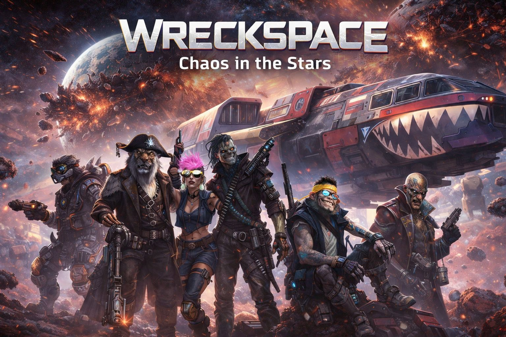

# WreckSpace

**WreckSpace** is a high-fidelity 3D space shooter prototype built with **Three.js**. It features immersive space flight mechanics, dynamic combat systems, and a polished sci-fi user interface.



## 🚀 Features

### 🌌 Immersive Space Flight
- **Physics-based Movement:** Drift mechanics, momentum-based flight, and responsive controls.
- **Visual Effects:** UnrealBloom post-processing, engine trails, space dust for speed perception, and volumetric fog.
- **Dynamic Camera:** Third-person camera that reacts to acceleration and maneuvers (camera shake, FOV shifts).

### ⚔️ Advanced Combat System
- **Target Lock:** Automatic target acquisition with visual snap-on crosshairs.
- **Aim Assist:** Smart projectile guidance when locked onto targets.
- **Feedback:** Visual hit markers, screen shake, and impact particles.

### 🛸 Economy & Progression
- **Loot System:** Destroy asteroids and enemies to spawn loot.
- **Magnet Mechanic:** Loot is automatically attracted to your ship when in range (with visual "vacuum" effects).
- **Cargo Management:** Manage your ship's storage capacity and return to base to sell resources.

### 🖥️ Sci-Fi HUD (Heads-Up Display)
- **Dynamic UI:** Real-time updates for Energy (Shields), Cargo, and Credits.
- **Navigation:** "Off-screen Indicator" system for the Base Station (points you in the right direction when the destination is not visible).
- **Spaceship Selection:** Choose from different ships with unique stats (Speed, Weapon Power, Cargo).

## 🎮 Controls

| Action | Key / Input |
| :--- | :--- |
| **Pitch & Yaw** | `W`, `A`, `S`, `D` or `Arrow Keys` |
| **Roll** | `Q`, `E` |
| **Boost / Afterburner** | `Z` |
| **Strafe / Dodge** | `Shift` + `A`/`D` |
| **Fire Weapon** | `Spacebar` or `Mouse Click` |

## 🛠️ Tech Stack

- **Core Engine:** [Three.js](https://threejs.org/)
- **Post-Processing:** Three.js EffectComposer (UnrealBloomPass)
- **Language:** Vanilla JavaScript (ES6+)
- **Styling:** CSS3 (Glassmorphism, CSS Transforms, Animations)
- **Build Tool:** Vite

## 📦 Installation & Setup

1.  **Clone the repository:**
    ```bash
    git clone https://github.com/yourusername/wreckspace.git
    cd wreckspace
    ```

2.  **Install dependencies:**
    ```bash
    npm install
    ```

3.  **Run the development server:**
    ```bash
    npm run dev
    ```

4.  **Open in Browser:**
    Navigate to the local URL provided by Vite (usually `http://localhost:5173`).

## 🔮 Future Roadmap

- [ ] Multiple enemy types and AI behaviors.
- [ ] Expanded upgrade system (weapons, engines, shields).
- [ ] Procedural galaxy generation.
- [ ] Multiplayer support.

---

*Built with ❤️ for space sim enthusiasts.*
